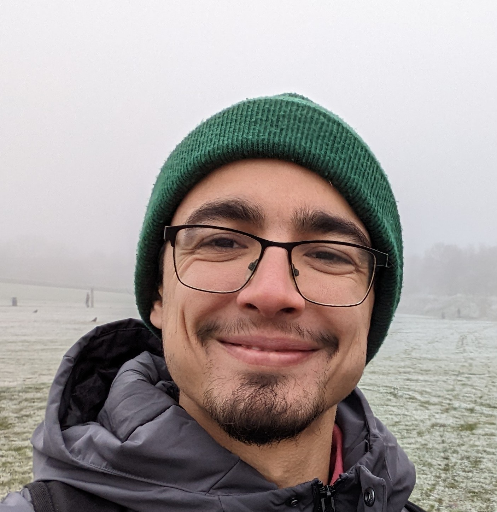

<!--
**Taha-Hassan-Git/Taha-Hassan-Git** is a ✨ _special_ ✨ repository because its `README.md` (this file) appears on your GitHub profile.

Here are some ideas to get you started:

- 🔭 I’m currently working on ...
- 🌱 I’m currently learning ...
- 👯 I’m looking to collaborate on ...
- 🤔 I’m looking for help with ...
- 💬 Ask me about ...
- 📫 How to reach me: ...
- 😄 Pronouns: ...
- ⚡ Fun fact: ...
-->

# Welcome! 👋 I'm Taha Hassan (He/Him)

  <kbd>
  
  </kbd>

- EFL teacher of 6 years 🧑‍🏫 
- Aspiring web developer 🕸️
- Too many hobbies to keep on top of 🥋🎥🎸🍳🚲

## Software Development Bootcamp
I'm currently on a front-end web-development bootcamp with [Founders and Coders](https://learn.foundersandcoders.com/).

  <kbd>
  
  </kbd>

## My Aspirations...
- [x] Learn the basics of web development
- [x] Get onto a great coding bootcamp
- [ ] Get hired as an apprentice
- [ ] Make amazing software that makes the world a better place

## I'm working on...
Expanding my 2D collision code into a game.

  <kbd>
  
  </kbd>

## I'm interested in learning more about...
- Developing software that is as accessibile as possible
- App development 
- The fall of the Ottoman empire

Get in touch if you want to chat about these things.

## Fun fact about me
I once made a film about the first gay community center in the UK, which you can check out [here](https://youtu.be/fZxapxG_ew4).

  <kbd>
  
  </kbd>

## My interests...
- I love learning natural languages as well as computer programming languages
- I've been training some form of martial arts for about 6 years
- I like making little guys in Blender and getting them to dance
- I'm in a punk band
